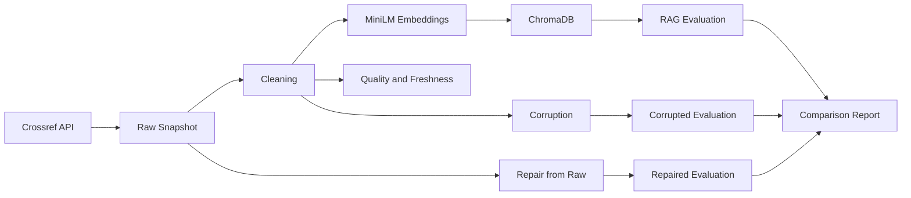

# Final Lab Report: Data Pipeline and Data Observability

## Team Information
> Pending: team member names and assignments will be supplied later.

## Lab Objective
Build, observe, corrupt, repair and evaluate a Crossref-backed RAG corpus.

## System Architecture

## Data Lineage
Crossref response → parsed raw records → clean contract → local MiniLM/Chroma index → evaluation and observability artifacts.

## Source, Cleaning and Retrieval
- Source: `{'source_api': 'Crossref REST API', 'source_query': 'agentic retrieval augmented generation large language model', 'source_filter': 'from-pub-date:2026-02-07,has-abstract:true'}`
- Clean rows: `24`; test-set samples: `12`
- Embedding model: `sentence-transformers/all-MiniLM-L6-v2`
- RAG answers use the same evaluation set for baseline, corrupted and repaired states.

## Evaluation Methodology
Retrieval hit rate, token F1, LLM judge accuracy/score, data quality checks and freshness are compared across three states.

## Baseline Results
`{'samples': 12, 'retrieval_hit_rate': 1.0, 'mean_token_f1': 0.75, 'judge_accuracy': 0.75, 'mean_judge_score': 4, 'judge_provider': 'gemini', 'judge_model': 'gemini-3.5-flash-lite', 'llm_judge_success_count': 12, 'llm_judge_fallback_count': 0, 'ragas': {'skipped': 'Set RUN_RAGAS=1 to enable the slower Ragas pass.'}}`

## Corruption and Repair Results
- Corrupted: `{'samples': 12, 'retrieval_hit_rate': 0.25, 'mean_token_f1': 0.03251507321274763, 'judge_accuracy': 0.0, 'mean_judge_score': 1, 'judge_provider': 'gemini', 'judge_model': 'gemini-3.5-flash-lite', 'llm_judge_success_count': 12, 'llm_judge_fallback_count': 0, 'ragas': {'skipped': 'Set RUN_RAGAS=1 to enable the slower Ragas pass.'}}`
- Repaired: `{'samples': 12, 'retrieval_hit_rate': 1.0, 'mean_token_f1': 0.75, 'judge_accuracy': 0.75, 'mean_judge_score': 4, 'judge_provider': 'gemini', 'judge_model': 'gemini-3.5-flash-lite', 'llm_judge_success_count': 12, 'llm_judge_fallback_count': 0, 'ragas': {'skipped': 'Set RUN_RAGAS=1 to enable the slower Ragas pass.'}}`
- Quality: `{'baseline': {'report_name': 'baseline', 'timestamp': '2026-08-06T05:51:34.824375+00:00', 'total_rows': 24, 'total_checks': 11, 'passed_checks': 11, 'failed_checks': 0, 'overall_success': True, 'checks': [{'name': 'row_count_sufficient', 'success': True, 'observed': 24, 'expected': 3, 'details': {'description': 'Minimum clean rows required to build an evaluation set'}}, {'name': 'paper_id_not_null', 'success': True, 'observed': 24, 'expected': 24, 'details': {}}, {'name': 'paper_id_unique', 'success': True, 'observed': 24, 'expected': 24, 'details': {}}, {'name': 'title_not_empty', 'success': True, 'observed': 24, 'expected': 24, 'details': {}}, {'name': 'summary_sufficient_length', 'success': True, 'observed': 24, 'expected': 24, 'details': {'min_required_length': 100}}, {'name': 'text_for_embedding_not_empty', 'success': True, 'observed': 24, 'expected': 24, 'details': {}}, {'name': 'no_duplicate_rows', 'success': True, 'observed': 0, 'expected': 0, 'details': {'fingerprint': 'normalized title, summary, published and authors_joined'}}, {'name': 'published_date_valid', 'success': True, 'observed': 24, 'expected': 24, 'details': {'future_dates': 0}}, {'name': 'age_days_valid', 'success': True, 'observed': 24, 'expected': 24, 'details': {}}, {'name': 'stale_records_ratio', 'success': True, 'observed': 0.0, 'expected': 0.0, 'details': {'stale_rows': 0, 'threshold_days': 180}}, {'name': 'latest_pub_date_fresh', 'success': True, 'observed': 5, 'expected': 180, 'details': {'threshold_days': 180}}]}, 'corrupted': {'report_name': 'corrupted', 'timestamp': '2026-08-06T05:53:08.494420+00:00', 'total_rows': 26, 'total_checks': 11, 'passed_checks': 8, 'failed_checks': 3, 'overall_success': False, 'checks': [{'name': 'row_count_sufficient', 'success': True, 'observed': 26, 'expected': 3, 'details': {'description': 'Minimum clean rows required to build an evaluation set'}}, {'name': 'paper_id_not_null', 'success': True, 'observed': 26, 'expected': 26, 'details': {}}, {'name': 'paper_id_unique', 'success': True, 'observed': 26, 'expected': 26, 'details': {}}, {'name': 'title_not_empty', 'success': True, 'observed': 26, 'expected': 26, 'details': {}}, {'name': 'summary_sufficient_length', 'success': False, 'observed': 19, 'expected': 26, 'details': {'min_required_length': 100}}, {'name': 'text_for_embedding_not_empty', 'success': True, 'observed': 26, 'expected': 26, 'details': {}}, {'name': 'no_duplicate_rows', 'success': False, 'observed': 3, 'expected': 0, 'details': {'fingerprint': 'normalized title, summary, published and authors_joined'}}, {'name': 'published_date_valid', 'success': True, 'observed': 26, 'expected': 26, 'details': {'future_dates': 0}}, {'name': 'age_days_valid', 'success': True, 'observed': 26, 'expected': 26, 'details': {}}, {'name': 'stale_records_ratio', 'success': False, 'observed': 0.3077, 'expected': 0.0, 'details': {'stale_rows': 8, 'threshold_days': 180}}, {'name': 'latest_pub_date_fresh', 'success': True, 'observed': 34, 'expected': 180, 'details': {'threshold_days': 180}}]}, 'repaired': {'report_name': 'repaired', 'timestamp': '2026-08-06T05:53:28.271688+00:00', 'total_rows': 24, 'total_checks': 11, 'passed_checks': 11, 'failed_checks': 0, 'overall_success': True, 'checks': [{'name': 'row_count_sufficient', 'success': True, 'observed': 24, 'expected': 3, 'details': {'description': 'Minimum clean rows required to build an evaluation set'}}, {'name': 'paper_id_not_null', 'success': True, 'observed': 24, 'expected': 24, 'details': {}}, {'name': 'paper_id_unique', 'success': True, 'observed': 24, 'expected': 24, 'details': {}}, {'name': 'title_not_empty', 'success': True, 'observed': 24, 'expected': 24, 'details': {}}, {'name': 'summary_sufficient_length', 'success': True, 'observed': 24, 'expected': 24, 'details': {'min_required_length': 100}}, {'name': 'text_for_embedding_not_empty', 'success': True, 'observed': 24, 'expected': 24, 'details': {}}, {'name': 'no_duplicate_rows', 'success': True, 'observed': 0, 'expected': 0, 'details': {'fingerprint': 'normalized title, summary, published and authors_joined'}}, {'name': 'published_date_valid', 'success': True, 'observed': 24, 'expected': 24, 'details': {'future_dates': 0}}, {'name': 'age_days_valid', 'success': True, 'observed': 24, 'expected': 24, 'details': {}}, {'name': 'stale_records_ratio', 'success': True, 'observed': 0.0, 'expected': 0.0, 'details': {'stale_rows': 0, 'threshold_days': 180}}, {'name': 'latest_pub_date_fresh', 'success': True, 'observed': 5, 'expected': 180, 'details': {'threshold_days': 180}}]}}`
- Freshness: `{'baseline': {'latest_published': '2026-08-01', 'oldest_published': '2026-02-12', 'invalid_publication_dates': 0, 'future_publication_dates': 0, 'invalid_age_days': 0, 'stale_rows': 0, 'total_rows': 24, 'stale_ratio': 0.0, 'is_fresh': True, 'freshness_threshold_days': 180}, 'corrupted': {'latest_published': '2026-07-03', 'oldest_published': '2021-07-13', 'invalid_publication_dates': 0, 'future_publication_dates': 0, 'invalid_age_days': 0, 'stale_rows': 8, 'total_rows': 26, 'stale_ratio': 0.3077, 'is_fresh': False, 'freshness_threshold_days': 180}, 'repaired': {'latest_published': '2026-08-01', 'oldest_published': '2026-02-12', 'invalid_publication_dates': 0, 'future_publication_dates': 0, 'invalid_age_days': 0, 'stale_rows': 0, 'total_rows': 24, 'stale_ratio': 0.0, 'is_fresh': True, 'freshness_threshold_days': 180}}`

## Reproducibility and Artifact Inventory
Run `uv sync --extra dev`, configure `.env`, run baseline first, then run corruption flow. Raw snapshots are retained so repair does not copy the baseline clean CSV.

- `E:\labVIn\lab 10\K3_Day10_Data-Pipeline-Data-Observability\data\raw\crossref_response.json`
- `E:\labVIn\lab 10\K3_Day10_Data-Pipeline-Data-Observability\data\raw\crossref_records.json`
- `E:\labVIn\lab 10\K3_Day10_Data-Pipeline-Data-Observability\data\clean\papers_clean.csv`
- `E:\labVIn\lab 10\K3_Day10_Data-Pipeline-Data-Observability\data\eval\test_set.json`
- `E:\labVIn\lab 10\K3_Day10_Data-Pipeline-Data-Observability\data\reports\corruption_report.md`

## Known Limitations
Provider availability, model nondeterminism and optional Ragas compatibility can affect LLM metrics.

## Final Conclusion
The conclusion is intentionally derived from the recorded baseline, corrupted and repaired artifacts; no fixed recovery percentage is asserted.
