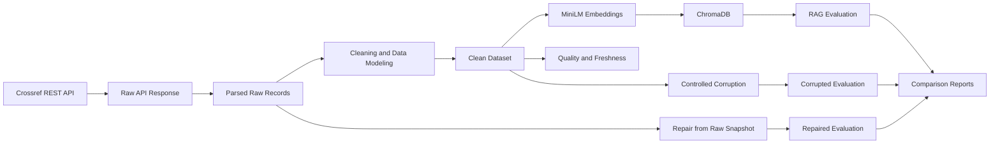

# BÁO CÁO NHÓM
## DAY 10 — DATA PIPELINE & DATA OBSERVABILITY

## 1. Thông tin nhóm

| STT | Họ và tên | MSSV | Branch | Phân công |
|---:|---|---|---|---|
| 1 | Vũ Văn Phong | 2A202601647 | `feat/pipeline-integration` | Tích hợp pipeline, cấu hình LLM, evaluation và end-to-end |
| 2 | Hoàng Lê Minh | 2A202601653 | `feat/crossref-ingestion` | Crossref ingestion, parsing, retry/backoff và raw artifacts |
| 3 | Nguyễn Quang Vinh | 2A202601517 | `feat/cleaning-testset` | Cleaning, data contract và evaluation test set |
| 4 | Phạm Sỹ Đức | 2A202601601 | `feat/data-corruption` | Các kịch bản data corruption và corruption log |
| 5 | Đoàn Nhật Nam | 2A202601123 | `feat/observability-reports` | Data quality, freshness và báo cáo |

## 2. Mục tiêu bài lab

Mục tiêu của bài lab là xây dựng một pipeline dữ liệu có khả năng thu thập, xử lý, lập chỉ mục, đánh giá và quan sát chất lượng dữ liệu cho một hệ thống Retrieval-Augmented Generation. Nhóm sử dụng dữ liệu bài báo khoa học từ Crossref, tạo clean corpus, embedding bằng MiniLM, lưu vào ChromaDB và đánh giá bằng một test set chung.

Điểm quan trọng của bài lab là không dừng ở baseline. Nhóm chủ động tạo dữ liệu lỗi có kiểm soát, đo mức suy giảm của retrieval và answer quality, sau đó repair từ raw snapshot để kiểm chứng khả năng phục hồi. Toàn bộ quá trình được theo dõi bằng metrics, quality checks, freshness reports và Markdown reports.

## 3. Kiến trúc hệ thống

Luồng dữ liệu chính:

`Crossref API → raw response → parsed raw records → clean dataset → embeddings/ChromaDB → test set → baseline evaluation → corruption → corrupted evaluation → repair from raw → repaired evaluation → reports`.

## 4. Công nghệ sử dụng

- **Python:** ngôn ngữ chính để xây dựng pipeline.
- **Requests:** gọi Crossref REST API với timeout và retry/backoff.
- **Pandas:** xây dựng, làm sạch và biến đổi DataFrame.
- **Sentence Transformers:** tạo local embeddings với `sentence-transformers/all-MiniLM-L6-v2`.
- **ChromaDB:** lưu vector index và metadata cho semantic search.
- **LangChain:** tích hợp LLM provider và agent tools.
- **Gemini:** dùng model `gemini-3.5-flash-lite` cho LLM-as-a-judge và agent demo.
- **Ragas 0.4.3:** đánh giá answer relevancy, context precision, context recall và faithfulness.
- **Pytest:** unit tests và integration tests.
- **uv:** quản lý dependency và môi trường chạy.

## 5. Crossref ingestion

Pipeline gọi Crossref endpoint `/works` với query `agentic retrieval augmented generation large language model` và filter yêu cầu publication date gần đây cùng abstract. Lần chạy chính thức thu được 24 raw records.

Module ingestion định nghĩa `PaperRecord` và parse DOI, title, abstract, authors, subjects, ngày xuất bản, ngày cập nhật, abstract URL và PDF URL. Abstract có thể chứa HTML/JATS nên được làm sạch trước khi lưu.

Để tăng độ ổn định, request có timeout, retry cho 429/5xx và exponential backoff. Response gốc được lưu tại `data/raw/crossref_response.json`, còn records sau parsing được lưu tại `data/raw/crossref_records.json`. Raw snapshot giúp tái lập pipeline và là nguồn đầu vào cho repair flow.

## 6. Cleaning và data modeling

Clean DataFrame sử dụng contract 12 trường:

`paper_id, title, summary, authors_joined, categories_joined, published, updated, age_days, summary_chars, text_for_embedding, abs_url, pdf_url`.

Cleaning chuẩn hóa whitespace, authors và categories; parse date về ISO; tính `age_days`; tạo `summary_chars`; kết hợp title, summary, authors và categories thành `text_for_embedding`. Record thiếu paper ID, title hoặc summary bị loại. Duplicate được xử lý theo paper ID và normalized title. Kết quả được sắp xếp deterministic.

Lần chạy chính thức tạo 24 clean records từ 24 raw records.

## 7. Embedding và ChromaDB

Pipeline sử dụng `all-MiniLM-L6-v2` để tạo embedding local. Mỗi trạng thái có một Chroma collection riêng:

- `papers-baseline`
- `papers-corrupted`
- `papers-repaired`

Index hỗ trợ semantic search và exact metadata lookup. Embedding artifacts được lưu trong `data/embeddings/`, còn local Chroma database có thể tái tạo nên không cần commit.

## 8. Evaluation test set

Test set được tạo deterministic từ ba document trong clean corpus. Mỗi document có bốn loại câu hỏi:

1. Nội dung bài báo.
2. Tác giả.
3. Ngày xuất bản.
4. Categories.

Tổng số mẫu là 12. Mỗi mẫu có ground truth và `ground_truth_doc_ids`. Baseline, corrupted và repaired đều dùng cùng một test set, nhờ đó kết quả so sánh phản ánh thay đổi của dữ liệu thay vì thay đổi câu hỏi.

## 9. Baseline pipeline

Baseline pipeline thực hiện:

1. Đọc hoặc tải raw data.
2. Chạy cleaning.
3. Lưu clean CSV/JSON.
4. Build embeddings và Chroma index.
5. Tạo hoặc tái sử dụng test set.
6. Chạy retrieval/answer evaluation.
7. Chạy LLM judge.
8. Chạy quality và freshness checks.
9. Sinh baseline report.
10. Chạy agent demo khi được bật.

Kết quả baseline:

| Metric | Giá trị |
|---|---:|
| Samples | 12 |
| Retrieval hit rate | 1.0000 |
| Mean token F1 | 0.7500 |
| Judge accuracy | 0.7500 |
| Mean judge score | 4 |
| LLM judge success | 12 |
| LLM judge fallback | 0 |

Baseline pass 11/11 data-quality checks. Freshness pass với stale ratio `0.0000`. Ngày xuất bản hợp lệ mới nhất là `2026-08-01`, cũ nhất là `2026-02-12`.

## 10. Data quality và freshness

Hệ thống kiểm tra:

- Số lượng row tối thiểu.
- Paper ID không null và duy nhất.
- Title không rỗng.
- Summary đủ độ dài.
- Embedding text không rỗng.
- Duplicate content.
- Published date hợp lệ.
- `age_days` hợp lệ.
- Stale-record ratio.
- Ngày xuất bản mới nhất còn fresh.

Freshness threshold là 180 ngày. Kết quả được lưu thành JSON để pipeline và báo cáo cùng sử dụng.

## 11. Data corruption

Nhóm triển khai các scenario:

- Drop important documents.
- Blank summary.
- Inject deterministic noise.
- Truncate title.
- Làm publication date stale.
- Add duplicate rows.
- Rebuild derived columns và tạo summary log.

Corruption ưu tiên các document có trong evaluation set. Log ghi nhận 7 scenario và 13 document IDs bị ảnh hưởng. Dataset corrupted có 26 rows do có thêm duplicate rows.

## 12. Repair strategy

Repair không sao chép baseline clean CSV. Pipeline đọc lại `data/raw/crossref_records.json`, chạy lại cleaning, rebuild embeddings/index và đánh giá bằng test set cũ. Cách này bảo đảm phục hồi dựa trên authoritative raw snapshot và giữ đúng data lineage.

Repaired dataset có 24 rows, pass lại 11/11 quality checks và stale ratio trở về `0.0000`.

## 13. So sánh baseline, corrupted và repaired

| Metric | Baseline | Corrupted | Repaired | Corrupted Δ | Repaired Δ |
|---|---:|---:|---:|---:|---:|
| Samples | 12 | 12 | 12 | 0 | 0 |
| Retrieval hit rate | 1.0000 | 0.2500 | 1.0000 | -0.7500 | 0.0000 |
| Mean token F1 | 0.7500 | 0.0325 | 0.7500 | -0.7175 | 0.0000 |
| Judge accuracy | 0.7500 | 0.0000 | 0.7500 | -0.7500 | 0.0000 |
| Mean judge score | 4 | 1 | 4 | -3 | 0 |
| LLM judge success | 12 | 12 | 12 | 0 | 0 |
| LLM judge fallback | 0 | 0 | 0 | 0 | 0 |

Corruption làm giảm mạnh cả retrieval và answer quality. Retrieval hit rate giảm 75 điểm phần trăm, token F1 gần về 0, còn LLM judge đánh giá toàn bộ corrupted answers không đạt. Sau repair, tất cả core metrics trở lại đúng baseline.

## 14. So sánh quality và freshness

| Trạng thái | Quality | Passed | Failed | Rows | Stale ratio |
|---|---|---:|---:|---:|---:|
| Baseline | PASS | 11 | 0 | 24 | 0.0000 |
| Corrupted | FAIL | 8 | 3 | 26 | 0.3077 |
| Repaired | PASS | 11 | 0 | 24 | 0.0000 |

Kết quả cho thấy observability checks phát hiện đúng dữ liệu lỗi. Corrupted state không chỉ làm giảm model metrics mà còn thất bại về chất lượng và freshness. Repair phục hồi đồng thời cả hai lớp đánh giá.

## 15. LLM judge và Ragas

LLM judge sử dụng Gemini `gemini-3.5-flash-lite`. Cả ba trạng thái đều có 12 lần judge thành công và 0 heuristic fallback. Chế độ `REQUIRE_LLM_JUDGE=1` ngăn pipeline âm thầm chuyển sang heuristic khi provider lỗi.

Ragas baseline thành công trên 9 mẫu hợp lệ:

| Ragas metric | Baseline |
|---|---:|
| Answer relevancy | 0.2462 |
| Context precision | 0.6667 |
| Context recall | 0.6667 |
| Faithfulness | 0.6667 |

Ba câu hỏi categories bị bỏ qua vì answer rỗng. Ragas trên corrupted state báo `failed` do các metric trả về không hợp lệ; đây là trạng thái không có metric chứ không phải metric bằng 0. Repaired state đang ở trạng thái skipped vì lần chạy đó không bật `RUN_RAGAS=1`.

## 16. Kiểm thử

Repository có tests cho:

- Crossref parsing và retry.
- Cleaning/data contract.
- Test-set generation.
- Corruption scenarios.
- Quality/freshness checks.
- Reporting.
- LLM provider config.
- Baseline và corruption/repair orchestration.

Integration tests dùng monkeypatch để xác minh luồng điều phối mà không cần gọi API thật trong mỗi lần test.

## 17. Artifact chính

| Nhóm | Đường dẫn | Vai trò |
|---|---|---|
| Raw data | `data/raw/` | Response và parsed raw records |
| Clean data | `data/clean/` | Baseline, corrupted và repaired datasets |
| Embeddings | `data/embeddings/` | Embedding manifests cho ba trạng thái |
| Test set | `data/eval/test_set.json` | Bộ 12 câu hỏi dùng chung |
| Metrics/answers | `data/results/` | Evaluation outputs và corruption log |
| Observability | `data/quality/` | Quality và freshness JSON |
| Reports | `data/reports/` | Baseline, comparison, group và individual reports |

## 18. Hạn chế

- Corpus chỉ có 24 bài báo và tập trung vào một query cụ thể.
- Test set được tạo từ chính clean corpus nên chưa đại diện cho toàn bộ câu hỏi thực tế.
- QA logic còn đơn giản và một số category answers rỗng.
- Ragas phụ thuộc provider và có thể không tạo metric hợp lệ trên dữ liệu bị corruption mạnh.
- ChromaDB chạy local, chưa có production vector service.
- Corruption scenarios là synthetic, chưa bao phủ toàn bộ lỗi dữ liệu ngoài thực tế.

## 19. Kết luận

Nhóm đã hoàn thành một pipeline dữ liệu end-to-end có raw ingestion, cleaning, embeddings, vector retrieval, evaluation, data observability, controlled corruption và repair. Kết quả chứng minh rõ rằng dữ liệu lỗi làm suy giảm mạnh retrieval và answer quality, đồng thời được quality/freshness checks phát hiện. Khi repair từ raw snapshot, core metrics, data quality và freshness đều quay lại baseline. Bài lab thể hiện đầy đủ vai trò của data lineage, reproducibility và observability trong hệ thống AI sử dụng dữ liệu ngoài.